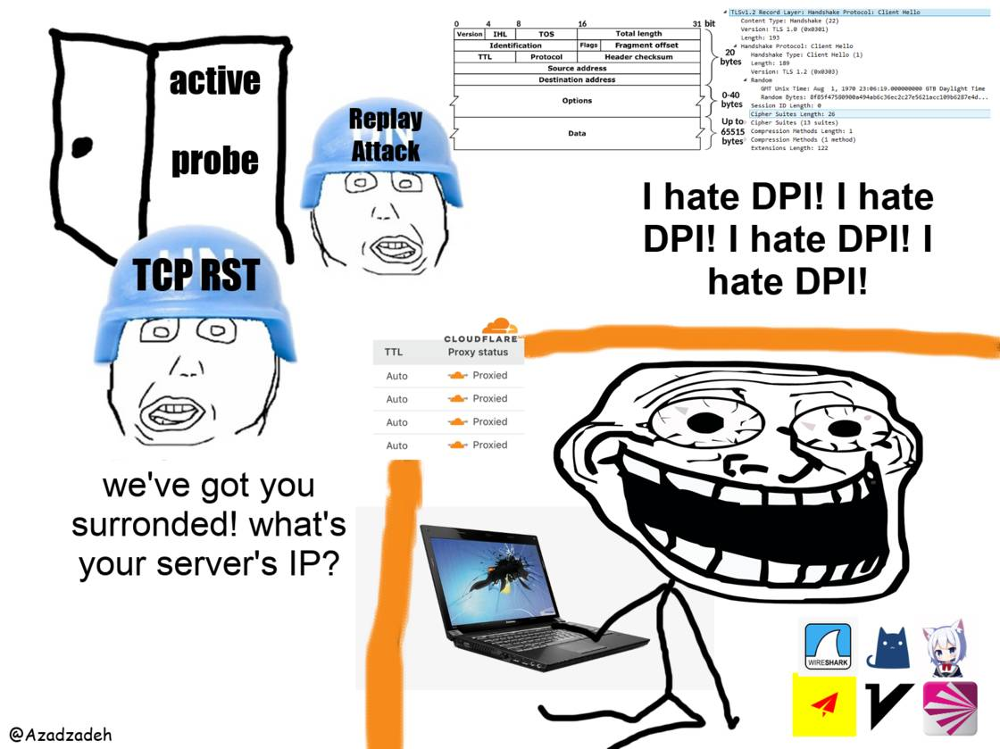

# iran-internet
A collection of guides documenting latest *functioning* censorship circumvention
methods with a focus on Iran, for a more technical audience.

The commands are assumed to be run on a UNIX-like operating system (GNU/Linux,
Android, MacOS, WSL/WSL2, etc)

## Build
`hugo --minify`

## Donation

XMR: `84RcKGbiQXTDdE6muAVNXZTKVcvMdrav3jdcRbfu4uNJB8eZCqMzP2Mi7U3GH3rra4GfJT2RMF7mdcTc2yXqZQEN5wmjEkA`

