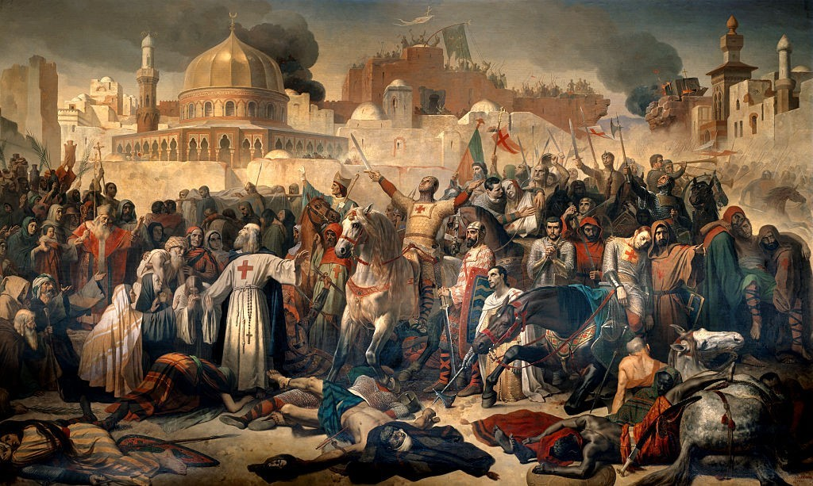

# شرایط بهره‌مندی

هدفم از ساخت این وبگاه این بود که در این روزهای تیره و تار کمی از بار اندوه و تنش ذهنی ایرانیانی که در دسترسی به اینترنت آزاد دچار اعصاب‌خردی شده‌اند، کم کنم.
با این حال، دسته‌ای از "انسان‌ها" هستند که من دوست ندارم حداقل از این بابت، خیری از من به آنان برسد.

- بچه شیعه اعم از ولایی، انقلابی، سنتی، صنعتی، مکتب نجفی، مکتب شیرازی، اصلاح‌طلب، "آقای جمهوری اسلامی‌"ها، "ما خودمون انتقاد داریم"ها،  و سایر فرق و انشعابات این بی‌حیاهای تاریخی.
چه شیعه‌ی سرخ باشید چه صورتی، چه قهوه‌ای، این وبگاه برای بی‌شرفان ساخته نشده، گورتان را از اینجا گم کنید.

- طالبانِ سلطنتی که مغزشان را آکبند گذاشته، از تاریخ ایران درس نگرفته و به دنبال یک واگرد تاریخی بی‌آبروکننده برای ایران هستند.
لطفاً بروید از همان ولی‌نعمتتان برای دسترسی به اینترنت کمک بگیرید.

- چپول‌ اعم از نوع میکس‌شده با شیعه‌گری (مجاهدین خلق) یا نوع مُفت‌خور آکادمیک آن (طیف موسوم به پراگرسیو).
کاش به جای حسادت به دیگران دنبال یادگیری فنی یا هنری باشید، تا مجبور نباشید برای پیدا کردن فاندی که از مالیات به دست آمده، بیست و پنج‌ساعت در روز در حال ژیمناستیک مغزی در توییتر و کلاب‌هاوس باشید.

- دختران اوپن‌مایندی که برای دوست پسر هشتمشان «نود» می‌فرستند، پسران فاکرمن و در کل جماعت الوات و لش و لوش.
شما بروید در همان گوگل‌پلی Ultimate Quick VPN 2023!! TOP 100% را نصب کنید. حتماً چنین برنامه‌هایی که مثل نقل و نبات ریخته، امن هستند.

- بچه زرنگ‌های ""آتئیست"" الیت ونک به بالا (یا پایین) که تنها هدفشان «در بُردن» خودشان از مهلکه و سپس تغییر نامشان از محدثه به مدیسون است.
گس وات؟ یو فاینالی مید ایت. نو نید تو فاک اراند ویت دیز استاف لایک دوز لوزرز بک این ایران، ام آی رایت؟

- سرویس‌های اطلاعاتی، صهیونیست‌ها، سعودی‌ها و سایر عوامل دولتی حقوق‌بگیر...
من بو می‌کشم، در رادار من نباشید.

- و اما پیروان اهل سنت، یهود و کلیمی، مسیحی و بهایی. کیست که نداند اگر دستتان به قدرت برسد، چه زامبی‌هایی خواهید شد.
حوصله‌ی شما را هم ندارم.

